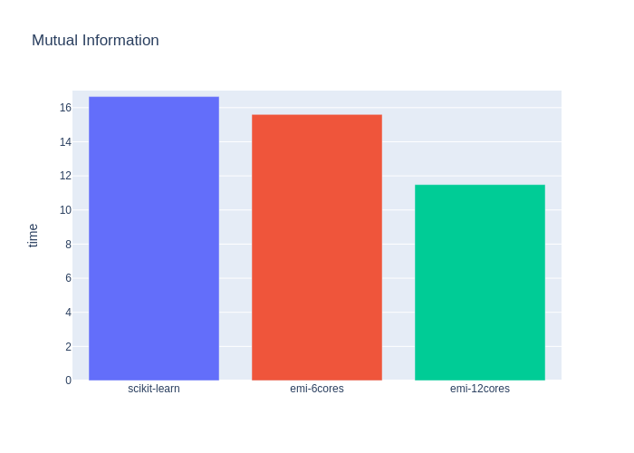

# Efficient Mutual Information estimation on big matrices

We found scikit-learn [mutual_info_score](https://scikit-learn.org/stable/modules/generated/sklearn.metrics.mutual_info_score.html) to be slow when estimating on big (>100000 entries) vecotors. This repo is the solution!


## Build

```bash
mkdir build
cd build
cmake ..
make
./local/src/hk
```


## Requirements:
`requirements.txt`

## Benchmark 
